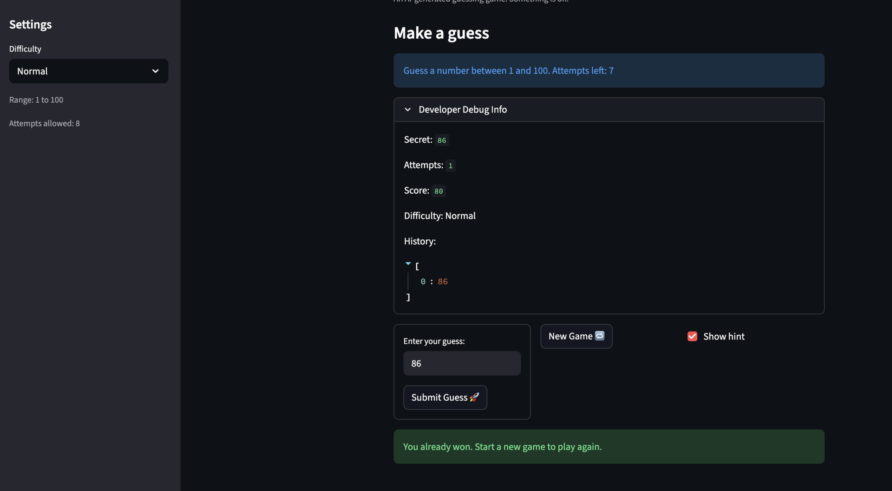

# 🎮 Game Glitch Investigator: The Impossible Guesser

## 🚨 The Situation

You asked an AI to build a simple "Number Guessing Game" using Streamlit.
It wrote the code, ran away, and now the game is unplayable. 

- You can't win.
- The hints lie to you.
- The secret number seems to have commitment issues.

## 🛠️ Setup

1. Install dependencies: `pip install -r requirements.txt`
2. Run the broken app: `python -m streamlit run app.py`

## 🕵️‍♂️ Your Mission

1. **Play the game.** Open the "Developer Debug Info" tab in the app to see the secret number. Try to win.
2. **Find the State Bug.** Why does the secret number change every time you click "Submit"? Ask ChatGPT: *"How do I keep a variable from resetting in Streamlit when I click a button?"*
3. **Fix the Logic.** The hints ("Higher/Lower") are wrong. Fix them.
4. **Refactor & Test.** - Move the logic into `logic_utils.py`.
   - Run `pytest` in your terminal.
   - Keep fixing until all tests pass!

## 📝 Document Your Experience

- The game's purpose is to check if your guess is correct or not and depending if the user wants hints, it will tell them to go lower or higher based on the guess.
- The bugs I found were when making a guess, you can't hit enter to guess, expected to confirm the guess, the new game button doesn't work, and to make a new guess, you need to hit submit button again.
 - Fixed Enter-to-submit by using `st.form` + `st.form_submit_button`, reset full Streamlit session state on New Game and initialized `attempts` correctly, moved pure game logic into `logic_utils.py` for testability, and adjusted `check_guess` to match the tests while mapping UI messages in `app.py`.

## 📸 Demo

- [ ] Screenshot of the fixed game:
   

## 🚀 Stretch Features

- [ ] [If you choose to complete Challenge 4, insert a screenshot of your Enhanced Game UI here]
